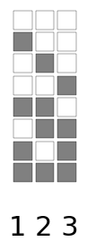
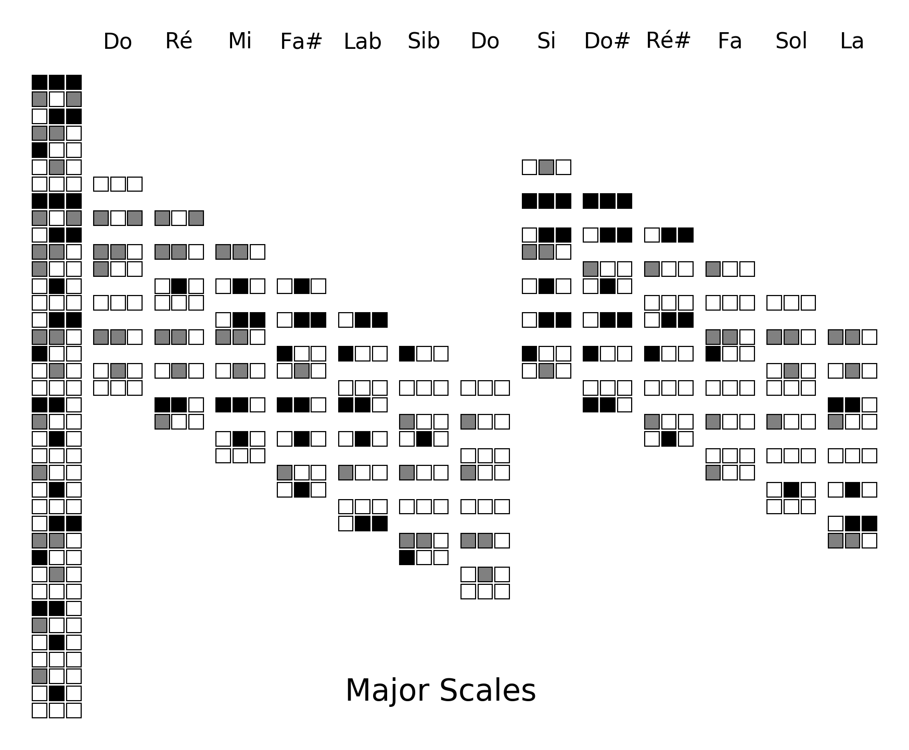
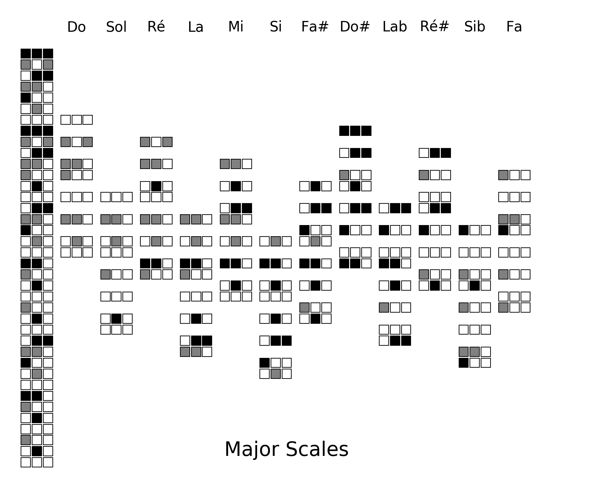
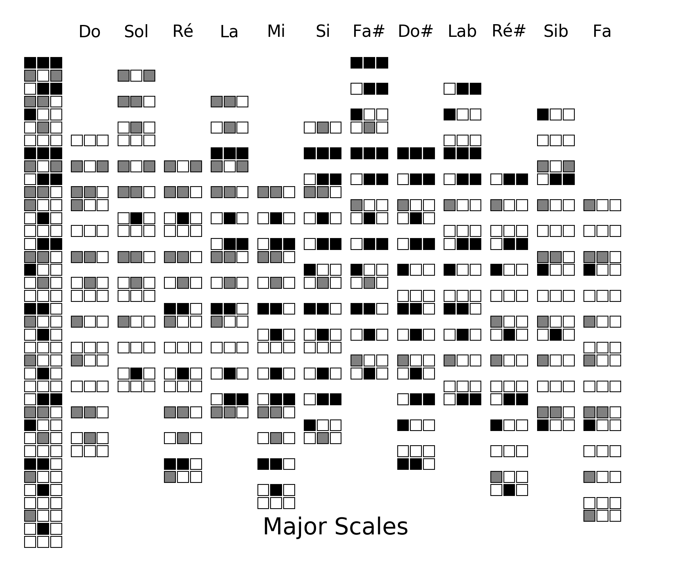
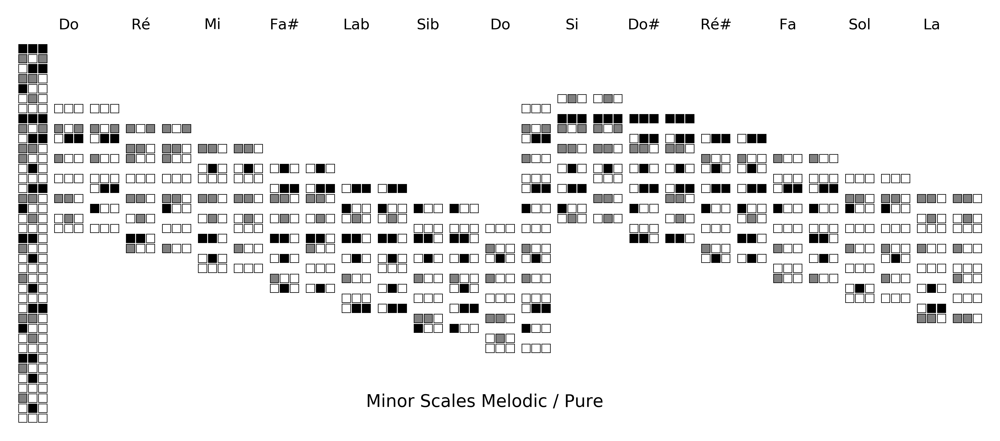
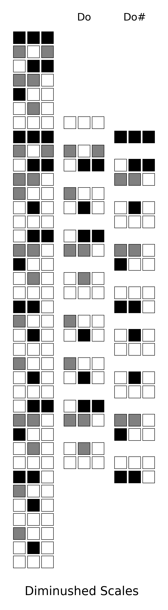
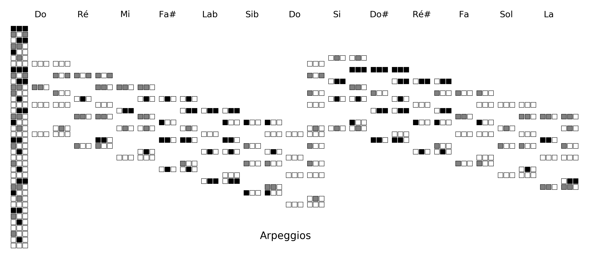
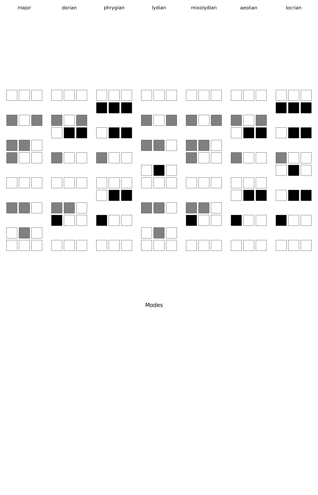

# Mosaic Scales for Valved Brass instrument

       ___- - -____/|
        (__|||__)  \|

With 3 valves there are 8 possibles combinations.

This can be represented using a box for each valve, a gray box is a valve down:

The same way a scale can be represented as a vertical mosaic to play from top to bottom.
 
Black is used to mimic the black keys on a piano.

Following are some scales, the column on the left is the chromatic scales from Fa#3 to Mi6.

Major scales:

Major scales by fifth:

Major scales by fifth on 2 octaves:

Minor scales Melodic/Pure:

Diminushed scales:

Arpeggios:

Modes:

Why doing this?
- Reading such mosaic scale is much easier than reading notes, you don't even need to be able to read music 
- You have a better visualisation of interval between notes
- The reverse notation helps thinking down going up and thinking up going down

That being said this is just for fun, also worth reading:  

https://ianring.com/musictheory/scales/

# Licence

Shield: [![CC BY 4.0][cc-by-shield]][cc-by]

This work is licensed under a
[Creative Commons Attribution 4.0 International License][cc-by].

[![CC BY 4.0][cc-by-image]][cc-by]

[cc-by]: http://creativecommons.org/licenses/by/4.0/
[cc-by-image]: https://i.creativecommons.org/l/by/4.0/88x31.png
[cc-by-shield]: https://img.shields.io/badge/License-CC%20BY%204.0-lightgrey.svg
